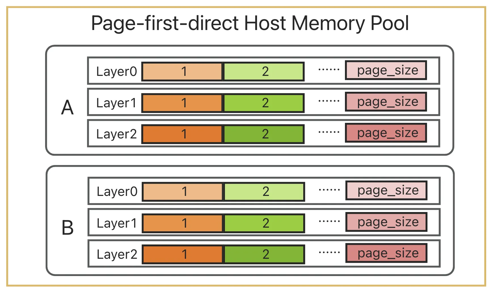

# 当SGLang 遇上 Mooncake：KV Cache 的三重奏

在大语言模型推理中，Prefill 阶段往往是最耗时的：输入序列需要先被转化为 Key-Value 缓存（KV Cache），供后续解码使用。如果多个请求共享相同的前缀内容，那么这些前缀部分的 KV Cache 实际上完全一致。通过将相同前缀的 KV Cache 缓存并复用，就可以避免重复计算。这样做的好处非常直接：减少无效的算力浪费，降低延迟，并在并发场景下显著提升整体吞吐量。换句话说，**“一次计算，多次使用”** 让模型在处理相似输入时更高效、更节省资源。因此，SGLang 此前提出了 RadixAttention，充分利用 GPU 中的闲置内存来缓存和重用相同前缀的 KV Cache。

然而，随着上下文长度增长和并发请求增加，KV Cache 的容量瓶颈问题日益凸显：GPU 内存容量是很有限的，但请求的上下文长度和 SLO 要求是无限的。RadixAttention 解决了前缀复用问题，但没有解决容量瓶颈问题。于是，SGLang 干脆把现代 CPU 的"三级缓存"这一经典设计搬到了大模型里。这就是 HiCache：GPU 显存当 L1，Host 内存当 L2，Mooncake、3FS、NIXL 等分布式缓存当 L3。设计思路直白，效果却十分惊艳——既缓解了 KV Cache 的容量焦虑，又把性能拉到了新高度。

经过大家数月的努力，目前 HiCache 已经[成功发布啦](https://lmsys.org/blog/2025-09-10-sglang-hicache/)！我们很开心能在这里做一个 HiCache 相关的技术分享，抛砖引玉。下面我们会首先介绍 SGLang HiCache 的背景和整体架构，然后详细介绍 HiCache 的一些实现细节和遇到的挑战，最后介绍接下来会做的一些工作。

**HiCache+Mooncake 的使用方法参见[这篇文档](https://kvcache-ai.github.io/Mooncake/getting_started/examples/sglang-integration/hicache-integration-v1)。欢迎大家来使用和贡献代码！我们期待更多开发者一起来打磨与拓展这个生态。**

## SGLang HiCache 简介

SGLang 是一个高性能的大语言模型推理服务框架，专为大规模部署和推理优化而设计。HiCache（Hierarchical KV Cache）是其中一项核心技术创新，主要用于解决现有 KV Cache 在容量上的瓶颈问题。

在长上下文和多轮对话场景中，现有的 RadixAttention 虽然能够高效复用 GPU 显存中的 KV Cache，但随着上下文长度的增长和并发请求的增加，缓存命中率会迅速下降——因为大部分旧的 KV Cache 不得不被淘汰，为新数据腾出空间。

为了解决这一挑战，HiCache 应运而生。它通过引入 HiRadixTree 作为页表，来统一引用 GPU 显存和 CPU 内存中的 KV Cache。同时，Cache Controller 负责自动管理跨层级的数据加载与回写，包括远程 KV Cache 的读取与写入。借助这一机制，HiCache 将 GPU、CPU、SSD 的“闲置”存储空间充分利用，并依赖 Mooncake、3FS、NIXL 等分布式存储系统来实现全局 KV Cache 的存储与调度。在保障读取性能的前提下，KV Cache 的可用容量得到了大幅提升。


上图展示了我们在 8 卡 H800 服务器上进行多轮对话测试的实验结果。其中 GPU only、+L2、+Mooncake 分别对应 KV Cache 仅包含 L1、包含 L1+L2、以及包含 L1+L2+Mooncake 的三种情况。结果清晰表明：缓存命中率对 prefill 性能有显著影响。

* 当缓存命中时，TTFT（Time To First Token） 明显低于未命中情况。
* 在前三轮对话中，+Mooncake 与 +L2 的命中率几乎相同，此时 +L2 的性能略优，因为它无需从远程存储获取数据。
* 随着对话轮数增加，KV Cache 的大小逐渐超过 L2 的容量，导致 +L2 的命中率持续下降，TTFT 显著增加。相比之下，+Mooncake 保持了高命中率，其 TTFT 仅缓慢上升。

在实际部署中，Mooncake 会将整个集群的内存聚合成一个大型分布式内存池，从而缓存海量 KV Cache。每个缓存的 KV 都能被所有的 SGLang 实例共享，这在相同内存预算下显著提升了整体命中率。因此，在大规模集群场景下，Mooncake 不仅能够有效降低推理延迟，还能显著提升吞吐量。

更多实验细节可参考我们的 [benchmark blog](https://kvcache-ai.github.io/Mooncake/performance/sglang-hicache-benchmark-results-v1.html)。关于 HiCache 的更完整介绍，可以参见 [SGLang 的 blog](https://lmsys.org/blog/2025-09-10-sglang-hicache/) 以及论文 [Strata](https://arxiv.org/abs/2508.18572)。

## 技术实现与优化

### 整体架构

在现在的不少 CPU 架构中，速度快、容量小的 L1 和 L2 cache 是每个核心私有的，用于快速存取最热点的数据，而最大的 L3 cache 则是所有核心共享的，这可以显著降低 cache 内的数据冗余程度。与此类似，HiCache 中 L1 和 L2 为每个推理实例的私有 KV Cache，而 L3 的 KV Cache 则为整个集群内所有推理实例共享。


### 本地元数据管理：HiRadixTree

在 KV Cache 的数据组织方面，HiCache 延续了 RadixAttention 的 RadixTree，提出了 HiRadixTree。RadixTree 中每一个节点对应于 GPU 中的若干连续 token 的 KV Cache。每一条从根到叶子节点的路径就代表了一条请求的前缀，多个请求的公共前缀可以共享节点，从而避免数据的冗余。关于 RadixAttention，更多细节可参见 SGLang 的[blog](https://lmsys.org/blog/2024-01-17-sglang/)和这篇[知乎文章](https://zhuanlan.zhihu.com/p/2511078239)。


与此类似，HiRadixTree 中，每一个节点对应于若干连续 token 的 KV Cache，并记录了这个节点的 KV Cache 存储在本地 GPU 显存、CPU 内存、L3 存储、亦或是其中的多个。如果 KV Cache 存储在本地，则会详细记录其对应的存储地址。而出于性能的考虑，HiRadixTree 不会存储或实时同步 L3 KV Cache 的元数据信息，在需要读取 L3 数据时，会通过 RPC 向 L3 的后端实时查询所需读取数据的元数据信息，如是否存在、存储在哪台服务器的什么位置等。

### 整体工作流

HiCache 的工作流程主要涉及两个关键操作：预取和写回。当系统收到新的请求时，会首先在本地的 L1 和 L2 中查找匹配的 KV Cache。对于本地未命中的部分，则会尝试从 L3 中预取。在预取结束后，将所有 KV Cache 加载到 GPU 中进行计算。在 Prefill 计算结束后，则会考虑将新的数据存入 L2 或 L3。


### 数据预取

数据预取是 HiCache 的核心优化技术之一，旨在提前将 L3 存储中的 KV Cache 加载到 L2 本地内存中，以减少后续访问时的延迟。预取的效率直接决定了 Prefill 的性能，因此，HiCache 采用了多层次的策略和优化机制。

**预取触发条件**：系统在检测到新的 Prefill 请求时，会首先在本地 L1 和 L2 中查找匹配的连续前缀的 KV Cache C1。对于本地未命中的部分，系统会查询 L3，得到 C1 之后的连续命中的 KV Cache C2 的元数据，如果 C2 长度超过阈值（默认 256 个 token，可配置），则执行预取操作。


**前缀感知**：算法保障取得的 KV Cache 一定是完整连续的前缀，需要重新计算的部分则为完整连续的后缀，如上图所示，从而方便了计算部分的实现。

**多线程、异步计算**： 数据预取采用了多线程、异步计算的方式提高预取效率。线程 `prefetch_thread_func` 会不断从 `prefetch_queue` 中取出可能需要预取操作的 Prefill 请求，并查询 L3 得到 C2，若 C2 超过阈值，则会放入等待预取的 `prefetch_buffer`。同时，`prefetch_io_aux_func` 线程会不断从 `prefetch_buffer` 中取出预取请求，并提交 L3 的后端执行。对于需要预取的数据，Mooncake 会通过 RDMA，并行地从多个远程存储节点中读取数据。这个设计让数据预取可以高效快速地完成。

**丰富、实用、灵活的预取策略**：预取操作面临一个时间不确定性的挑战。预取完成时间取决于多种因素，如网络状况、存储后端的负载、数据大小（由模型、参数、需要预取的 token 数量等确定）等，很难准确预测。如果等待时间过长，会导致 prefill 计算延迟显著增加，影响整体推理性能；如果等待时间太短，预取操作可能还没完成就被终止，导致无法利用预取的结果，浪费了预取的开销。因此，HiCache 提供了三种不同的预取停止策略来应对不同的场景需求：
- **best_effort**：尽力而为模式，GPU 可以执行 prefill 计算时即立刻终止，不会有任何等待时间，适合对延迟极其敏感的场景。
- **wait_complete**：等待完成模式，必须等待所有预取操作完成，适合对缓存命中率要求极高的场景。
- **timeout**：超时模式，在指定时间后或完成时终止，平衡了延迟和缓存命中率的需求。

在预取停止后，已经预取完成的数据（上图中的 C2a 部分）会连同本地的数据（上图中的 C1 部分）一起被用于本次的 Prefill 计算。

我们发现，在实际部署中，`timeout` 策略可能相对来说更为实用。一方面，预取延迟不确定；另一方面，预取截止时间受到 SLO（服务级别目标）的约束。因此，允许用户灵活配置预取超时参数，并根据每个请求的预取 token 数量动态确定超时值，具有很高的实用价值。为此，HiCache 引入了 2 个配置参数来支持精细地控制预取超时条件：
- `prefetch_timeout_base`：基础超时时间，表示与 token 数量无关的开销（如调度和同步）；
- `prefetch_timeout_per_ki_token`：每千个 token 的超时时间增量。

超时时间的计算公式为：
```
timeout = prefetch_timeout_base + prefetch_timeout_per_ki_token * num_token_to_fetch / 1024
```
这种动态超时机制使得系统能够根据实际的数据传输量智能调整预取时间窗口，在保证 SLO 要求的同时最大化预取效率。

### 数据写回

数据写回机制负责将频繁访问的 KV Cache 从 L1 逐步写回到 L2 和 L3，实现更为长期和大容量的存储，以及跨实例的缓存共享。


**可配置的写回策略**：HiCache 支持三种写入策略：
- **write_through**：每次访问都立即写回到下一层。在带宽允许的情况下，这种策略提供了最强的缓存收益。
- **write_through_selective**：访问频率达到阈值后才写回到下一层。这种策略只备份热点数据，减少 I/O 负载。
- **write_back**：在被上一层 evict 时才写回到下一层。这个策略可以有效缓解存储压力，适合存储容量有限但需要最大化内存利用率的场景。

用户可根据具体的系统配置、使用场景和性能需求选择最适合的写回策略。

**异步、并行的写回**：数据写回采用了异步、并行的方式提高写回效率。写回操作以 HiRadixTree 中的一个节点中的 KV Cache 为单位，当该节点的 KV Cache 达到相应条件时，系统会触发写回操作。

当数据从 L1 写回到 L2 时，会调用 `write_backup` 函数进行异步数据传输，避免阻塞主调度流程。

当数据从 L2 写回到 L3 存储时，系统会调用 `write_backup_storage` 函数，将写回操作放入 `backup_queue` 中。专门的 `backup_thread_func` 线程会不断从队列中取出写回操作并调用 L3 后端执行数据传输。和预取类似，Mooncake 可以通过 RDMA 并行、高速地完成数据的传输。

**跨实例共享**：在从 L2 写回到 L3 时，只有 L3 中尚未存在的数据会通过数据传输进行写回。写回到 L3 的 KV Cache 可被集群中所有 SGLang 实例共享，在相同的内存预算下显著提升了缓存命中率。

### 多Rank间的同步机制

在多卡并行计算时，例如在多 TP 计算时，HiCache 需要确保多个 rank 之间的状态一致性。因此，在计算的关键步骤均需要使用 `all_reduce` 来同步状态。例如，在 prefetch 时，首先需要使用 `all_reduce(op=min)` 来确保所有 rank 获得相同的 L3 命中数量，避免不同 rank 对于是否达到预取阈值有不同的判断；在完成或终止预取后，同样也需要使用 `all_reduce(op=min)` 确保所有 rank 对成功获取的 KV Cache 的前缀长度取得共识。

### 数据传输优化

**零数据拷贝**：不论在预取还是在写回阶段，都涉及到大量的数据传输工作。尽可能减少数据拷贝的次数可以显著提升系统性能：
- HiCache 支持数据从 L2 内存到 L3 后端时，直接传入内存地址和大小；
- Mooncake 对上提供了零拷贝的读写接口，支持从 L2 到 RDMA 传输之间完全的零拷贝。预取的时候，可从远端内存通过 RDMA 直接将数据读入 L2 目标内存；写回时，可将 L2 的数据通过 RDMA 直接写入到远端的目标地址，从而实现了整个数据传输过程完全的零拷贝。

**数据的"整存整取"**：在我们的测试中发现，读写数据的粒度对性能的影响很大。如果每个 token 的每一层 KV 都是一个单独的对象，假设层数为 61，一次性读写的 token 数量为 2048，则会对应约 12.5 万个对象。大量的小对象会极大降低传输效率，增大 L3 的元数据管理负担。为此，HiCache L3 采用 Page 为粒度存储和读写 KV Cache。如果 page size 等于 64，则 2048 个 token 只对应了 32 个对象，对象数量相比于 naive 的方法减少了 3904 倍，相对的，每个对象的大小也增大了 3904 倍。

同时，对于 KV Cache 的数据组织方式，在已有的 `layer first` 的基础上，HiCache L2 还支持 `page first` 和 `page first direct` 的布局。在使用 `page first` 或 `page first direct` 的情况下，同一个 page 的所有 KV Cache 数据都放在连续的内存里，可以直接作为一个完整的对象通过零拷贝的方式传递给 L3。


但由于 GPU 中 KV 的计算是按层进行的，所以 GPU 中天然是 `layer first` 的。而将 `page first` 的 L2 数据传入 `layer first` 的 GPU 时，只能以一个 token 的一个 layer 为粒度传。`page first direct` 则改善了这个问题，在此布局下，L2 到 GPU 的传输可以将一个 page 的一个 layer 聚合到一起。


更进一步，Mooncake 支持高效的批量读写，并能够利用 RDMA 对一个 batch 的数据通过多个网卡并行地同多个远程节点进行数据传输。在 HiCache 中，目前经验性地将 batch size 的上限设置为 128 个 page，超过该值则会被拆分为多个 batch。这是一种权衡：一方面，通过批量并行传输可以提升 I/O 效率；另一方面，分批完成则能保证在 `best_effort` 或 `timeout` 设置触发终止时，至少已完成的 batch 数据能够被利用上。

**CPU 与 GPU 间的传输优化**：在 HiCache 中，与从 L3 预取数据到 L2 类似，将数据从 CPU 移动到 GPU 的过程同样是性能关键。HiCache 为此采用了多项优化：
- 存算重叠：在 Prefill 阶段将 CPU 内存的数据传入 GPU 时，HiCache 采用层间重叠机制，在第 N 层计算时，并发的加载第 N+1 层的 KV cache，从而有效隐藏数据传输的延迟。
- GPU-assisted I/O kernels：在 `cudaMemcpyAsync` 之上，HiCache 开发了一套 GPU 辅助 I/O 内核，专门针对 CPU-GPU 之间的 KV Cache 数据传输进行了优化。相比前者实现了至多 3 倍的传输速度提升。具体实现细节可以参考[transfer.cu](https://github.com/sgl-project/sglang/blob/main/sgl-kernel/csrc/kvcacheio/transfer.cu)。

**MLA 的写回优化**：对于 MHA（Multi-Head Attention）模型，在多 TP 时，每个 rank 持有一个 token 的 `1/tp_size` 的 KV 数据；而对于 MLA（Multi-Layer Attention）模型，所有的 rank 都持有一个 token 完整的、相同的数据，这意味着多个 rank 存储着重复的数据。在最初的实现中，HiCache 没有特判 MLA，在写回 L3 时所有 rank 均会将本地数据传入 L3（以前缀哈希+rank 为索引），这导致 MLA 下所有数据都被写入和存储了多份。针对于此，HiCache 对 MLA 加上了特判逻辑，保证只有一个 rank 会发起写回操作，数据也不会存储多份。

### 和PD分离部署模式的结合

此前，SGLang 已经支持通过 Mooncake TransferEngine 实现 PD（Prefill-Decode）分离部署模式（相关资料参见[这个blog](https://kvcache-ai.github.io/Mooncake/getting_started/examples/sglang-integration-v1.html)）。这种架构将 Prefill 和 Decode 阶段分离到不同节点，P 节点专门负责处理 Prefill 阶段的计算，D 节点专门负责 Decode 阶段的计算。

在 PD 分离部署模式下，可以在 Prefill 节点开启 HiCache 来优化 Prefill 性能。通过 HiCache+Mooncake Store 的分层缓存机制，P 节点能够更高效地处理长上下文和多轮对话场景，显著提升预填充阶段的性能。目前只需要部署一套 Mooncake，即可完整体验到上述优化 ^_^

## 下一步工作讨论

**不同 TP Size 的实例共享 KV Cache**：在大规模部署中，特别是在异构环境中，集群内可能存在不同 TP size 的 SGLang 实例。当前的 HiCache 实现存在一个限制：当 TP size 大于 1 时，每个 token 的 KV Cache 会被拆分到不同的 rank 中，每个 rank 只存储 1/tp_size 的数据。这意味着在 L3 存储中，同一个 token 的 KV cache 会以 tp_size 个不同的对象形式存储。

这种设计导致了一个重要问题：即使不同 TP size 的实例处理相同的模型和相同的前缀，由于 KV Cache 的拆分粒度不同，它们无法共享 L3 存储中的 KV Cache 数据。例如，一个 TP=2 的实例和一个 TP=4 的实例处理相同的输入序列时，它们的 KV Cache 在 L3 中存储为不同粒度的对象，无法实现跨实例的缓存共享。

下一步我们会实现 KV Cache 数据的动态重组，在零拷贝的前提下，实现不同 TP size 配置的 KV Cache 的数据共享。

**前缀感知的 Eviction**：当前 HiCache 的 eviction 策略在不同层级采用了不同的策略。在 L1 和 L2 层级，系统会从 HiRadixTree 的叶子节点开始 eviction，这种设计避免了在前缀上出现空洞，确保缓存的前缀完整性。然而，L3 存储后端目前缺乏前缀信息，只能采用传统的 LRU 等算法进行对象级别的 eviction，这可能导致重要的前缀数据被误删。但是，L3 只从叶子删除也有缺陷，因为热点数据可能在 L1 和 L2 里已有保留，L3 再重复存储也可能造成空间浪费。

因此我们后续会考虑将 HiRadixTree 的前缀信息传递到 L3 存储后端，使其能够同时基于数据访问信息和前缀信息做出决策。

注1：文中的部分图片来自[SGLang Blog](https://lmsys.org/), [Mooncake Blog](https://kvcache-ai.github.io/Mooncake/) 和蚂蚁的[晟海](https://github.com/huangtingwei9988)，非常感谢。

注2：目前[page first direct 的 pr](https://github.com/sgl-project/sglang/pull/10060)和[动态计算预取 timeout 的 pr](https://github.com/sgl-project/sglang/pull/10512)暂时还没 merge 到主线。
