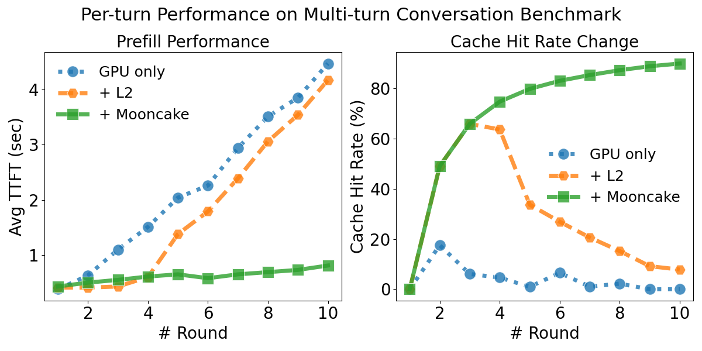

# 当SGLang 遇上 Mooncake：KV Cache 的三重奏

还记得当年学习计算机组成原理时，被CPU的L1、L2、L3的3级缓存搞得头昏脑涨的日子吗？那时候笔者就在想：为什么CPU需要这么多层缓存和复杂的MESI协议？直接弄一个大的L1不香吗？

后来才明白——如果没有这些分层缓存，就很难在系统上实现容量和速度上的既要又要：大家又想要缓存容量大、又想要访问速度快、还想尽量节省成本，那3级缓存的无论哪一级，单拎出来都做不到，只能让他们组合起来、互相取长补短才行。

如今，大语言模型在推理时也遇到了类似的麻烦：KV Cache的容量是有限的， 但是请求的上下文长度和SLO要求是无限的。于是，SGLang团队借鉴CPU的老办法，干脆把“三级缓存”这一经典设计搬到了大模型里。

这就是 HiCache：GPU显存当L1，Host内存当L2，Mooncake、3FS、NIXL等分布式缓存当L3。思路简单粗暴，却效果惊艳——既缓解了KV Cache的容量焦虑，又把性能拉到了新高度。事实证明，“缓存金字塔”不只属于CPU，它在大模型时代依然有用武之地。

**下面我们会简单介绍SGLang HiCache的背景，然后详细介绍HiCache的一些实现和优化上的细节与亮点，最后介绍我们今后的规划。**

## SGLang HiCache 简介

SGLang是一个高性能的大语言模型推理服务框架，专为大规模部署和优化推理性能而设计。HiCache（Hierarchical KV Cache）是SGLang中引入的一项关键技术创新，旨在解决现有KV Cache系统面临的容量瓶颈问题。在长上下文和多轮对话场景中，现有的RadixAttention虽然能够有效复用GPU内存中的KV Cache，但随着上下文长度增长和并发客户端增加，缓存命中率会显著下降，因为大部分历史KV Cache必须被驱逐，为新数据腾出空间。

针对上述挑战，HiCache应运而生。HiCache通过引入HiRadixTree作为页表来引用位于本地GPU和CPU内存中的KV Cache，并配备一个缓存控制器自动管理跨层级的KV缓存数据加载和备份，以及远程KV Cache的读取和写入，从而将GPU、CPU、SSD的“闲置”存储空间都利用起来，并依赖Mooncake、3FS、NIXL等分布式存储系统对全局的KV Cache进行存储和管理，在保障读取性能的同时大大提升了KV Cache的容量

上面这幅图展示了我们在8卡H800的服务器上测试多轮对话的实验结果。其中GPU only, +L2, +Mooncake分别表示KV Cache包含了L1, L1+L2, L1+L2+Mooncake。可以看到KV Cache命中率对prefill性能有显著影响。当缓存命中时，TTFT明显低于缓存未命中的情况。在前三轮对话中，+Mooncake和+L2表现出相同的缓存命中率。在这个阶段，+L2略快于+Mooncake，因为它不需要从远程存储获取数据。然而，随着轮数增加，当KV缓存大小超过+L2的内存容量时，+L2的命中率逐渐下降，导致TTFT显著增加。相比之下，Mooncake保持了高命中率，其TTFT增长非常缓慢。

在实际部署中，Mooncake 将整个集群的内存聚合成一个大型分布式内存池，从而能够缓存大量的 KV Cache。每个缓存的 KV 都可以被所有 SGLang 实例共享，这在相同的内存预算下显著提升了缓存命中率。因此，在大规模SGLang集群中，Mooncake 能够降低推理的延迟，并提升吞吐量。上述实验的细节详见我们的[blog](https://kvcache-ai.github.io/Mooncake/performance/sglang-hicache-benchmark-results-v1.html)。

## 技术实现与优化

### 整体架构

在现在的不少CPU架构中，速度快、容量小的L1和L2 cache是每个核心私有的，用于快速存取最热点的数据，而最大的L3 cache则是所有核心共享的，从而大大降低cache内的数据冗余程度。与此类似，HiCache中L1和L2为每个推理实例的私有KV cache，而L3的KV cache则为整个集群内所有推理实例共享，

### Workflow

**优化的数据平面**：
- 开发了GPU辅助I/O内核，相比标准`cudaMemcpyAsync`提供高达3倍的CPU-GPU传输吞吐量
- 采用"页优先"布局优化CPU内存池，与GPU的"层优先"布局解耦，实现更大的单次传输大小
- 结合零拷贝机制，在典型部署中实现高达2倍的吞吐量提升

**灵活的控制平面**：
- 当GPU缓存未命中但CPU内存命中时，采用层间重叠机制，在层N执行时并发加载层N+1的KV缓存，有效隐藏数据传输延迟
- 对于外部存储，缓存控制器在检测到存储层缓存命中时机会性地将数据预取到主机内存
- 支持多种预取策略：尽力而为模式、超时终止模式和更积极的请求暂存模式

### 1.2.3 存储后端支持

HiCache的设计亮点在于其简洁的存储后端接口。通过实现三个核心功能（`get(key)`、`exist(key)`、`set(key, value)`），可以轻松集成新的存储后端。目前支持的后端包括：

- **Mooncake**：高性能分布式内存存储系统
- **3FS**：阿里云TairKVCache团队提供的存储后端
- **NIXL**：NVIDIA设计的传输库，用于桥接GPU直连存储和云对象存储
- **HiCacheFile**：简单的文件后端，用于演示和参考

### 1.2.4 性能表现

根据社区反馈和基准测试结果，HiCache在多个场景下都取得了显著的性能提升：

- **Novita AI**：在Qwen3-Coder-480B编码代理场景中，平均TTFT（Time To First Token）降低56%，推理吞吐量翻倍，缓存命中率从40%提升至80%
- **Ant Group**：在DeepSeek-R1-671B模型的通用QA场景测试中，缓存命中相比完全重计算实现了84%的TTFT降低
- **官方基准测试**：实现了高达6倍的吞吐量提升和80%的TTFT降低

### 1.2.5 实现细节

从代码实现来看，HiCache的核心组件包括：

1. **HiRadixCache**：继承自RadixCache，管理分层缓存逻辑
2. **HiCacheController**：负责缓存控制、数据传输和存储操作
3. **HiCacheStorage**：抽象存储接口，支持多种后端实现

系统支持多种写入策略（write-through、write-through-selective、write-back）和IO后端（kernel、direct），能够根据不同的部署场景和性能需求进行灵活配置。

HiCache的成功不仅体现在性能提升上，更重要的是它提供了一个可扩展的架构，使得社区可以轻松集成新的存储后端，推动了整个生态系统的发展。
