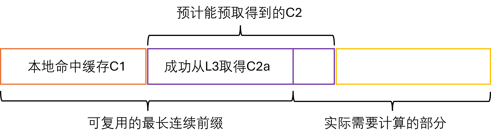

# 当SGLang 遇上 Mooncake：KV Cache 的三重奏

在大语言模型推理中，Prefill阶段需要将输入序列转化为Key-Value缓存（KV Cache）供后续解码使用。如果多个请求共享相同的前缀内容，那么这些前缀部分的KV Cache其实是完全一致的。通过将相同前缀的KV Cache缓存并复用，就可以避免重复计算。这样做的动机很直接：减少无效的算力浪费，降低延迟，并在并发场景下显著提升整体吞吐量。换句话说，**“一次计算，多次使用”** 让模型在处理相似输入时更高效、更省资源。因此，SGLang此前提出了RadixAttention，利用GPU中的闲置内存来缓存和重用相同前缀的KV Cache。

然而，随着上下文长度增长和并发请求增加，KV Cache的容量瓶颈问题日益凸显：GPU内存容量是很有限的，但请求的上下文长度和SLO要求是无限的。于是，SGLang干脆把现代CPU的"三级缓存"这一经典设计搬到了大模型里。这就是 HiCache：GPU显存当L1，Host内存当L2，Mooncake、3FS、NIXL等分布式缓存当L3。思路简单粗暴，却效果惊艳——既缓解了KV Cache的容量焦虑，又把性能拉到了新高度。

经过大家数月的努力，目前HiCache已经[成功发布啦](https://lmsys.org/blog/2024-01-17-sglang/)！我们很开心能在这里做一个HiCache相关的技术分享，抛砖引玉。下面我们会首先介绍SGLang HiCache的背景和整体架构，然后详细介绍HiCache的一些实现细节和遇到的挑战，最后介绍预期接下来会做的一些工作。

**同时也欢迎大家来使用和贡献代码! 使用我们的Mooncake作为HiCache后端的方法可以参见[这篇文档](https://kvcache-ai.github.io/Mooncake/getting_started/examples/sglang-integration/hicache-integration-v1)。**

## SGLang HiCache 简介

SGLang是一个高性能的大语言模型推理服务框架，专为大规模部署和优化推理性能而设计。HiCache（Hierarchical KV Cache）是SGLang中引入的一项关键技术创新，旨在解决现有KV Cache系统面临的容量瓶颈问题。在长上下文和多轮对话场景中，现有的RadixAttention虽然能够有效复用GPU内存中的KV Cache，但随着上下文长度增长和并发客户端增加，缓存命中率会显著下降，因为大部分旧的KV Cache必须被踢出取，为新数据腾出空间。

针对上述挑战，HiCache应运而生。HiCache通过引入HiRadixTree作为页表来引用位于本地GPU显存和CPU内存中的KV Cache，并配备一个缓存控制器自动管理跨层级的KV缓存数据加载和备份，以及远程KV Cache的读取和写入，从而将GPU、CPU、SSD的“闲置”存储空间都利用起来，并依赖Mooncake、3FS、NIXL等分布式存储系统对全局的KV Cache进行存储和管理，在保障读取性能的同时大大提升了KV Cache的容量


上面这幅图展示了我们在8卡H800的服务器上测试多轮对话的实验结果。其中GPU only, +L2, +Mooncake分别表示KV Cache包含了L1, L1+L2, L1+L2+Mooncake。可以看到KV Cache命中率对prefill性能有显著影响。当缓存命中时，TTFT明显低于缓存未命中的情况。在前三轮对话中，+Mooncake和+L2表现出相同的缓存命中率。在这个阶段，+L2略快于+Mooncake，因为它不需要从远程存储获取数据。然而，随着轮数增加，当KV缓存大小超过+L2的内存容量时，+L2的命中率逐渐下降，导致TTFT显著增加。相比之下，Mooncake保持了高命中率，其TTFT增长非常缓慢。

在实际部署中，Mooncake 将整个集群的内存聚合成一个大型分布式内存池，从而能够缓存大量的 KV Cache。每个缓存的 KV 都可以被所有 SGLang 实例共享，这在相同的内存预算下显著提升了缓存命中率。因此，在大规模SGLang集群中，Mooncake 能够降低推理的延迟，并提升吞吐量。

上述实验的细节详见我们的[blog](https://kvcache-ai.github.io/Mooncake/performance/sglang-hicache-benchmark-results-v1.html)。对HiCache的介绍可以参见SGLang的[blog](https://lmsys.org/blog/2025-09-10-sglang-hicache/)和[Strata](https://arxiv.org/abs/2508.18572)这篇论文。

## 技术实现与优化

### 整体架构

在现在的不少CPU架构中，速度快、容量小的L1和L2 cache是每个核心私有的，用于快速存取最热点的数据，而最大的L3 cache则是所有核心共享的，这可以显著降低cache内的数据冗余程度。与此类似，HiCache中L1和L2为每个推理实例的私有KV cache，而L3的KV cache则为整个集群内所有推理实例共享，


### 元数据管理：HiRadixTree

在KV cache的数据组织方面，HiCache延续了RadixAttention的RadixTree，提出了HiRadixTree。RadixTree中每一个节点对应于GPU中的若干连续token的kv cache。每一条从根到叶子节点的路径就代表了一条请求的前缀，多个请求的公共前缀可以共享节点，从而避免数据的冗余。关于RadixAttention，更多细节可参见SGLang的[blog](https://lmsys.org/blog/2024-01-17-sglang/)和这篇[知乎文章](https://zhuanlan.zhihu.com/p/2511078239)。


与此类似，HiRadixTree中，每一个节点对应于若干连续token的kv cache，并记录了这个节点的kv cache存储在本地GPU显存、CPU内存、L3存储、亦或是其中的多个。如果kv cache存储在本地，则会详细记录其对应的存储地址。而出于性能的考虑，HiRadixTree不会存储或实时同步L3 kv cache的元数据信息，在需要读取L3数据时，会通过RPC向L3的后端实时查询所需读取数据的元数据信息，如是否存在、存储在哪台服务器的什么位置等。在我们的性能测试中，向Mooncake查询元数据信息通常只需要零点几到2毫秒的时间。

### 整体工作流

HiCache的工作流程主要涉及两个关键操作：预取和写回。当系统收到新的请求时，会首先在本地的L1和L2中查找匹配的KV缓存。对于本地未命中的部分，则会尝试从L3中预取。在预取结束后，将所有KV Cache加载到GPU中进行计算。在Prefill计算结束后，则会考虑将新的数据存入L2或L3。


### 数据预取

数据预取是HiCache的核心优化技术之一，旨在提前将L3存储中的KV缓存加载到L2主机内存中，以减少后续访问时的延迟。预取的效率直接决定了Prefill的性能，因此，HiCache采用了多层次的策略和优化机制。

**预取触发条件**：系统在检测到新的Prefill请求时，会首先在本地L1和L2中查找匹配的连续前缀的KV缓存C1。对于本地未命中的部分，系统会查询L3，得到C1之后的连续命中的KV缓存C2的元数据，如果C2长度超过阈值（默认256个token，可配置），则执行预取操作。



**前缀感知**：算法保障取得的KV Cache一定是完整连续的前缀，需要重新计算的部分则为完整连续的后缀，如上图所示，从而方便了计算部分的实现。

**多线程、异步计算**： 数据预取采用了多线程、异步计算的方式提高预取效率。线程`prefetch_thread_func`会不断从`prefetch_queue`中取出可能需要预取操作的Prefill请求，并查询L3得到C2，若C2超过阈值，则会放入等待预取的`prefetch_buffer`。同时，` prefetch_io_aux_func`线程会不断从`prefetch_buffer`中取出并通过L3的后端执行预取请求。对于需要预取的数据，Mooncake会通过传输速度可达每秒数十GB甚至更多的RDMA，并行地从远程存储节点中读取数据。这个设计让数据预取可以高效快速地完成。

**丰富、实用、灵活的预取策略**：预取操作面临一个时间不确定性的挑战。预取完成时间取决于多种因素，如网络状况、存储后端性能、数据大小（由模型、参数、需要预取的token数量等确定）等，很难准确预测。如果等待时间过长，会导致prefill计算延迟显著增加，影响整体推理性能；如果等待时间太短，预取操作可能还没完成就被终止，导致无法利用预取的结果，浪费了预取的开销。因此，HiCache提供了三种不同的预取停止策略来应对不同的场景需求：
- **best_effort**：尽力而为模式，GPU可以执行prefill计算时即立刻终止，不会有任何等待时间，适合对延迟极其敏感的场景。
- **wait_complete**：等待完成模式，必须等待所有预取操作完成，适合对缓存命中率要求极高的场景
- **timeout**：超时模式，在指定时间后或完成时终止，平衡了延迟和缓存命中率的需求。

在预取停止后，已经预取完成的数据（上图中的C2a部分）会连同本地的数据（上图中的C1部分）一起被用于本次的Prefill计算。

我们发现，在实际部署中，`timeout`策略可能相对来说更为实用。一方面，预取延迟不确定；另一方面，预取截止时间受到SLO（服务级别目标）的约束。因此，允许用户灵活配置预取超时参数，并根据每个请求的预取token数量动态确定超时值，具有很高的实用价值。为此，HiCache引入了2个配置参数来支持精细地控制预取超时条件：
- `prefetch_timeout_base`：基础超时时间，表示与token数量无关的开销（如调度和同步）；
- `prefetch_timeout_per_ki_token`：每千个token的超时时间增量。

超时时间的计算公式为：
```
timeout = prefetch_timeout_base + prefetch_timeout_per_ki_token * num_token_to_fetch / 1024
```
这种动态超时机制使得系统能够根据实际的数据传输量智能调整预取时间窗口，在保证SLO要求的同时最大化预取效率。

### 数据写回

数据写回机制负责将频繁访问的KV缓存从L1逐步写回到L2和L3，实现更为长期和大容量的存储，以及跨实例的缓存共享。


**可配置的写回策略**：HiCache支持三种写入策略：
- **write_through**：每次访问都立即写回到下一层。在带宽允许的情况下，这种策略提供了最强的缓存收益。
- **write_through_selective**：访问频率达到阈值
后才写回到下一层。这种策略只备份热点数据，减少I/O负载。
- **write_back**：在被上一层evict时才写回到下一层。这个策略可以有效缓解存储压力，适合存储容量有限但需要最大化内存利用率的场景。

用户可根据具体的硬件配置和性能需求选择最适合的写回策略

**多线程、异步的写回**：数据写回采用了多线程、异步计算的方式提高写回效率。写回操作以HiRadixTree中的一个节点中的KV Cache为单位，当该节点的KV Cache达到对应写回策略的写回条件时，系统会触发写回操作。

当数据从L1写回到L2时，会调用`write_backup`函数，使用GPU流进行异步数据传输，避免阻塞主调度流程。

当数据从L2写回到L3存储时，系统会调用`write_backup_storage`函数，将写回操作放入`backup_queue`队列中。专门的`backup_thread_func`线程会不断从队列中取出写回操作并调用L3后端执行数据传输。和预取类似，Mooncake可以通过RDMA，并行、高速地完成数据的传输。

**跨实例共享**：在从L2写回到L3时，只有L3中尚未存在的数据会通过数据传输进行写回。写回到L3的KV Cache可被集群中所有SGLang实例共享，在相同的内存预算下显著提升了缓存命中率。

### 多Rank间的同步机制

在多卡并行计算时，例如在多TP计算时，HiCache需要确保多个rank之间的状态一致性。因此，在计算的关键步骤均需要使用`all_reduce`来同步状态。例如，在prefetch时，首先需要使用`all_reduce(op=min)`来确保所有rank获得相同的L3命中数量，避免不同rank对于是否达到预取阈值有不同的判断；在完成或终止预取后，同样也需要使用`all_reduce(op=min)`确保所有rank对已有kv cache缓存的前缀长度取得共识。

### 数据传输优化

**零数据拷贝**：不论在预取还是在写回阶段，都涉及到大量的数据传输工作。尽可能减少数据拷贝的次数可以显著提升系统性能：
- HiCache支持数据从L2内存到L3后端时，直接传入内存地址和大小；
- Mooncake对上提供了零拷贝的读写接口，支持从L2到RMDA传输之间完全的零拷贝。预取的时候，可从远端内存通过RDMA直接将数据读入L2目标内存；写回时，可将L2的数据通过RDMA直接写入到远端的目标地址。从而实现了整个数据传输过程完全的零拷贝。

**数据的“整存整取”**：在我们的测试中发现，读写数据的粒度对性能的影响很大。如果每个token的每一层KV都是一个单独的对象，假设层数为61，一次性读写的token数量为2048，则会对应约12.5万个对象。大量的小对象会极大降低传输效率，增大L3的元数据管理负担。
为此，HiCache L3采用Page为粒度存储和读写KV Cache。同时，对于KV Cache的数据组织方式，在已有的`layer first`的基础上，HiCache L2还支持`page first`。在使用`page first`的情况下，同一个Page的所有的KV Cache数据都放在连续的内存里，可以直接作为一个完整的对象通过零拷贝的方式传递给L3。如果Page Size等于64，则2048个token只对应了32个对象，对象数量相比于naive的方法减少了3904倍，相对的，每个对象的大小也增大了3904倍。

更进一步，Mooncake 支持高效的批量读写，并能够利用 RDMA 对一个 batch 的数据通过多个网卡并行地同多个远程节点进行数据传输。在 HiCache 中，目前经验性地将 batch size 的上限设置为 128 个 page，超过该值则会被拆分为多个 batch。这是一种权衡：一方面，通过批量并行传输可以提升 I/O 效率；另一方面，分批完成则能保证在 `best_effort` 或 `timeout` 设置触发终止时，至少已完成的 batch 数据能够被利用上。

**MLA的写回优化**：对于MHA（Multi-Head Attention）模型，在多TP时，每个rank持有一个token的`1/tp_size`的KV数据；而对于MLA（Multi-Layer Attention）模型，所有的rank都持有一个token完整的、相同的数据，这意味着多个rank存储着重复的数据。在最初的实现中，HiCache没有特判MLA，在写回L3时所有rank均会将本地数据传入L3（以前缀哈希+rank为索引），这导致MLA下所有数据都被写入和存储了多份。针对于此，HiCache对MLA加上了特判逻辑，保证只有一个rank会发起写回操作，数据也不会存储多份。

**CPU与GPU间的传输优化**：在HiCache中，与从L3预取数据到L2类似，将数据从CPU移动到GPU的过程同样是性能关键。HiCache为此采用了多项优化：
- 存算重叠：在Prefill阶段将CPU内存的数据传入GPU时，HiCache采用层间重叠机制，在第N层计算时，并发的加载第N+1层的KV cache，从而有效隐藏数据传输的延迟。
- GPU-assisted I/O kernels：在`cudaMemcpyAsync`之上，HiCache开发了一套GPU辅助I/O内核，专门针对CPU-GPU之间的KV缓存数据传输进行了优化。相比前者实现了至多3倍的传输速度提升。具体实现细节可以参考[transfer.cu](https://github.com/sgl-project/sglang/blob/main/sgl-kernel/csrc/kvcacheio/transfer.cu)。

**Page First Direct**

### 和PD分离部署模式的结合

此前，SGLang已经支持通过Mooncake TransferEngine实现PD（Prefill-Decode）分离部署模式（相关资料参见[这个blog](https://kvcache-ai.github.io/Mooncake/getting_started/examples/sglang-integration-v1.html)）。这种架构将预填充和解码阶段分离到不同节点，P节点专门负责处理预填充阶段的计算，D节点专门负责解码阶段的计算。

在PD分离部署模式下，可以在Prefill节点开启HiCache来优化预填充性能。通过HiCache的分层缓存机制，P节点能够更高效地处理长上下文和多轮对话场景，显著提升预填充阶段的性能。目前只需要部署一套Mooncake，即可体验到上述优化 ^_^

## 下一步工作讨论

**不同TP Size的实例共享KV Cache**：在大规模部署中，特别是在异构环境中，集群内可能存在不同TP size的SGLang实例。当前的HiCache实现存在一个限制：当TP size大于1时，每个token的KV cache会被拆分到不同的rank中，每个rank只存储1/tp_size的数据。这意味着在L3存储中，同一个token的KV cache会以tp_size个不同的对象形式存储。

这种设计导致了一个重要问题：即使不同TP size的实例处理相同的模型和相同的前缀，由于KV cache的拆分粒度不同，它们无法共享L3存储中的KV cache数据。例如，一个TP=2的实例和一个TP=4的实例处理相同的输入序列时，它们的KV cache在L3中存储为不同粒度的对象，无法实现跨实例的缓存共享。

下一步我们会实现KV cache数据的动态重组，在零拷贝的前提下，实现不同TP size配置的KV Cache的数据共享。

**前缀感知的Eviction**：当前HiCache的eviction策略在不同层级采用了不同的策略。在L1和L2层级，系统会从HiRadixTree的叶子节点开始eviction，这种设计避免了在前缀上出现空洞，确保缓存的前缀完整性。然而，L3存储后端目前缺乏前缀信息，只能采用传统的LRU等算法进行对象级别的eviction，这可能导致重要的前缀数据被误删。但是，L3只从叶子删除也有缺陷，因为热点数据可能在L1和L2里已有保留，L3再重复存储也可能造成空间浪费。

因此我们后续会考虑将HiRadixTree的前缀信息传递到L3存储后端，使其能够同时基于数据访问信息和前缀信息做出决策。

注：文中的部分图片来自[SGLang Blog](https://lmsys.org/) 和 [Mooncake Blog](https://kvcache-ai.github.io/Mooncake/)，非常感谢。